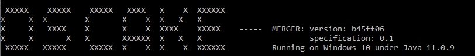

# Running OSCake-Merger
OSCake Merger is a tool allowing to combine valid OSCake Reporter (and OSCake validated) output files into a single package for distribution.

## Installation

The git repository can be found [here](https://github.com/telekom/oscake-merger)

1. Clone the repository: `git clone https://github.com/telekom/oscake-merger.git`
2. Change into directory `oscake-merger`
3. Run: `chmod 777 gradlew`
3. Run: `./gradlew instDist`
4. Run: `./build/install/OSCake-Merger/bin/OSCake-Merger -v` for verification

If the program is installed correctly, the following welcome screen should be displayed:



The version information corresponds to the latest git commit.

## Commandline parameters
In order to see the usage information of the program, run `build\install\OSCake-Merger\bin\OSCake-Merger -h`

```
Usage: merger-main [OPTIONS]

Options:
* -i, --inputDirectory PATH   The path to a folder containing oscc files and
                              their corresponding archives. May also consist
                              of subdirectories.
  -o, --outputDirectory PATH  The path to the output folder.
* -c, --cid TEXT              Id of the Compliance Artifact Collection.
  -f, --outputFile PATH       Name of the output file. When -o is also
                              specified, the path to the outputFile is
                              stripped to its name.
  -a, --archiveFile PATH      Name of the archive file. When -o is also
                              specified, the path to the archiveFile is
                              stripped to its name.
  -v, --version               Show version information and exit.
  -h, --help                  Show this message and exit

* denotes required options.
```

Option "-c": An identifier is a string defined by its type, namespace, name and version (e.g. "Maven:joda-time:joda-time:2.10.8"). If no output files are specified (options -f and -a) the filenames are generated based on the ID, whereas ":" are replaced by ".". If the identifier contains characters which are not allowed in filenames (e.g. "\*") the program is aborted.


## Processing & Issues & Error Handling

During the processing of the input files, every package is copied into the output file - if it does not already exist. In order to avoid collisions between file references in the zip archive, a unique identifier is prepended to the reference and also to the name of the archived file.

If an \*.oscc file in the input folder has set the property "hasIssues" to "true", then this information is automatically propagated to the output file and the input file is excluded from further processing steps. 

In larger projects it may happen that a specific package is contained in more than one input file. In this case, the first occurrence is imported and the content of the second one is checked against it. If there are some differences concerning the license or copyright information, this is logged - different file paths (references to the files in the archive) are ignored.

The logging is implemented by means of `Apache log4j2` and can be configured as described in the OSCake-Reporter section (see [here](./architecture-and-code.md) - but use `OS_CAKE_MERGER_OPTS`instead of `ORT_OPTS`)
